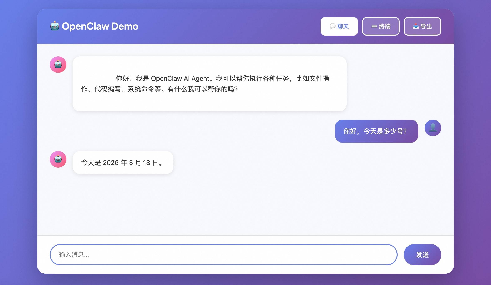

# ClawMonitor - AI Agent Monitor

<div align="center">

[](https://www.docker.com/)
[](https://www.python.org/)
[](LICENSE)

**🚀 The Ultimate OpenClaw Monitoring & Execution Platform**

**Containerized isolation · Interactive front-end · Batch execution · Memory monitoring export**

English | [简体中文](README_CN.md)



</div>

---

## 🎯 Why ClawMonitor?

ClawMonitor is a comprehensive monitoring and execution platform for [OpenClaw](https://github.com/openclaw/openclaw), offering **four core capabilities** that set it apart:

### 🐳 **Container Isolation**
- Each task runs in an isolated Docker container
- Zero interference between tasks
- Easy to scale and manage
- Clean environment for every execution

### 💬 **Interactive Web Frontend**
- Beautiful chat interface for real-time interaction
- Built-in terminal for direct container access
- Session history export functionality
- Memory monitoring and visualization

### ⚡ **Batch Execution**
- True async parallel task processing
- Configurable concurrency (3-100+ tasks)
- Smart retry with exponential backoff
- Automatic result persistence

### 📊 **Memory Monitoring & Export**
- Track agent conversation history
- Export sessions in JSONL format
- Analyze multi-turn interactions
- Monitor tool usage and responses

---

## 🚀 Quick Start

### ⭐ Two Ways to Use ClawMonitor

#### Option 1: Interactive Demo (Recommended for Getting Started)
Perfect for testing, development, and single-task interaction.

```bash
# 1. Build Docker image
docker build --no-cache -t clawmonitor-openclaw:latest -f Dockerfile.openclaw .

# 2. Configure API keys in config.yaml
# Edit api.key, api.url, and gateway.auth_token

# 3. Start interactive demo
python demo.py
```

Your browser will automatically open to `http://localhost:8080` with:
- 💬 **Chat Interface** - Real-time interaction with OpenClaw agent
- ⌨️ **Container Terminal** - Direct access to container shell
- 📥 **Export Function** - Download conversation history in JSONL format

#### Option 2: Batch Runner (For Large-Scale Tasks)
Perfect for running hundreds of tasks in parallel.

```bash
# 1. Prepare task file (decomposed_epoch1.jsonl)
# 2. Run batch execution
python batch_runner.py

# 3. Monitor with visual dashboard (optional)
python visual_batch_runner.py
```

### Prerequisites

1. **Docker** (Required)
   - macOS: [Docker Desktop for Mac](https://docs.docker.com/desktop/install/mac-install/)
   - Windows: [Docker Desktop for Windows](https://docs.docker.com/desktop/install/windows-install/)
   - Linux: [Docker Engine](https://docs.docker.com/engine/install/)

2. **Python 3.12+**
   ```bash
   python --version  # Verify Python version
   ```

3. **Conda/Miniconda** (Recommended)
   - Download: [Miniconda](https://docs.conda.io/en/latest/miniconda.html)

### Installation

#### 1. Clone Repository

```bash
git clone https://github.com/yourusername/ClawMonitor.git
cd ClawMonitor
```

#### 2. Setup Python Environment

**Option A: Using Conda (Recommended)**

```bash
# Create environment from environment.yml
conda env create -f environment.yml

# Activate environment
conda activate base
```

**Option B: Using pip**

```bash
# Create virtual environment
python -m venv venv
source venv/bin/activate  # Linux/macOS
# or venv\Scripts\activate  # Windows

# Install dependencies
pip install -r requirements.txt
```

#### 3. Configure API Keys

Edit `config.yaml` and fill in your API credentials:

```yaml
# ============ API Configuration (Required) ============
api:
  key: "your-api-key-here"           # Your API Key
  url: "https://your-api-url.com"    # API Endpoint URL

# ============ Gateway Configuration ============
gateway:
  auth_token: "your-secure-token"    # Gateway auth token

# ============ Concurrency Configuration ============
max_concurrent: 5                    # Number of concurrent tasks (3-10 recommended)
```

#### 4. Build Docker Image

```bash
# Build OpenClaw image
docker build --no-cache -t clawmonitor-openclaw:latest -f Dockerfile.openclaw .
```

#### 5. Prepare Task Data

Place your tasks in `decomposed_epoch1.jsonl` with the following format:

```json
{"record_id": "task-001", "instruction": "Complete XX task", "category": "coding", "deomposed_query": "{\"turns\": [{\"thought\": \"Analyze requirements\", \"output\": \"Please help me...\"}, {\"thought\": \"Implement feature\", \"output\": \"Now start...\"}]}"}
```

#### 6. Run Batch Tasks

```bash
python batch_runner.py
```

---

## 📋 Configuration Guide

### Core Parameters

#### 1. API Configuration (Required)

```yaml
api:
  key: ""          # Your API key
  url: ""          # API endpoint URL
```

#### 2. Model Configuration

```yaml
model:
  id: "gpt-51-1113-global"           # Model ID
  name: "gpt-51-1113-global"         # Model name
  context_window: 400000             # Context window size
  max_tokens: 128000                 # Max generation tokens
```

#### 3. Concurrency Control

```yaml
max_concurrent: 5                    # Number of simultaneous containers
                                     # Recommended: 3-10 (depends on system resources)
                                     # Higher value = faster completion, more memory

agent:
  max_concurrent: 4                  # Agent internal concurrency
  subagents_max_concurrent: 8        # Sub-agent concurrency
```

**Performance Example:**
- `max_concurrent: 5` + 10 min/task = **10 minutes** for 5 tasks
- `max_concurrent: 1` + 10 min/task = **50 minutes** for 5 tasks

#### 4. Retry Strategy

```yaml
retry:
  # Prompt request retry configuration
  prompt:
    max_attempts: 3      # Retry up to 3 times on failure
    min_wait: 4          # Wait 4 seconds before first retry
    max_wait: 10         # Max wait 10 seconds (exponential backoff)

  # Health check retry configuration
  health_check:
    max_attempts: 30     # Container startup check retries
    min_wait: 2          # Wait 2 seconds each time
    max_wait: 5          # Max wait 5 seconds
```

**Retry Behavior Example:**
```
Attempt 1: Send immediately
Failure ❌ → Wait 4 seconds

Attempt 2: Retry
Failure ❌ → Wait 8 seconds

Attempt 3: Final attempt
Success ✅ or Failure ❌
```

#### 5. Gateway Configuration

```yaml
gateway:
  port: 18789                        # Gateway port
  mode: "local"                      # Operation mode
  bind: "lan"                        # Network binding (Docker requires lan)
  auth_token: ""                     # Auth token (required)
```

#### 6. Feature Flags

```yaml
features:
  browser_enabled: true              # Enable browser features
  browser_evaluate_enabled: true     # Enable browser evaluation
  browser_attach_only: true          # Attach to existing browser only
  cron_enabled: true                 # Enable cron jobs
  web_enabled: true                  # Enable web features
  canvas_host_enabled: true          # Enable canvas host
```

---

## 🔧 Usage Guide

### Interactive Demo Usage

#### 1. Start Demo Server

```bash
python demo.py
```

The demo will:
- Automatically start an OpenClaw container
- Launch web interface at `http://localhost:8080`
- Open your browser automatically
- Wait for container to be ready

#### 2. Chat with Agent

Simply type your questions in the chat interface:
- Ask the agent to perform tasks
- Execute file operations
- Write and run code
- Use built-in tools

#### 3. Access Container Terminal

Click the **Terminal** button to:
- Run shell commands directly
- Inspect container filesystem
- Debug issues in real-time
- Monitor process status

#### 4. Export Session History

Click the **Export** button to:
- Download complete conversation in JSONL
- Save to custom location (optional)
- Analyze agent behavior offline
- Share results with team

### Batch Runner Usage

#### 1. Basic Batch Execution

```bash
# Use default config and task file
python batch_runner.py
```

#### 2. Visual Batch Dashboard

```bash
# Run with real-time visual monitoring
python visual_batch_runner.py
```

Features:
- Live progress tracking
- Task status visualization
- Error highlighting
- Concurrent execution monitoring

#### 3. Custom Configuration

Modify `batch_runner.py`:

```python
runner = BatchRunner(
    config_path="custom_config.yaml",
    jsonl_path="my_tasks.jsonl"
)
runner.run()
```

#### 4. Monitor Execution

```bash
# View container logs
docker logs -f openclaw-task-<record_id>

# List running containers
docker ps
```

### Advanced Usage

#### 1. Adjust Concurrency

Tune concurrency based on your system resources:

```yaml
# config.yaml
max_concurrent: 10  # More aggressive concurrency (needs more memory)
```

**Resource Estimation:**
- Each container requires ~**2-4GB memory**
- `max_concurrent: 5` ≈ 10-20GB memory
- `max_concurrent: 10` ≈ 20-40GB memory

#### 2. Adjust Retry Strategy

For unstable APIs:

```yaml
retry:
  prompt:
    max_attempts: 5    # Increase retry count
    min_wait: 2        # Faster retry
    max_wait: 20       # Allow longer wait
```

#### 3. Persist Session Data

Edit `docker-compose.yml`:

```yaml
volumes:
  - ./sessions:/root/.openclaw/agents/main/sessions
  - ./workspace:/root/.openclaw/workspace
```

#### 4. Use Docker Compose (Optional)

```bash
# Single container test
docker-compose up -d

# View logs
docker-compose logs -f

# Stop service
docker-compose down
```

---

## 📂 Project Structure

```
ClawMonitor/
├── demo.py                      # 🎨 Interactive web demo (NEW!)
├── batch_runner.py              # ⚡ Batch task scheduler
├── visual_batch_runner.py       # 📊 Visual batch dashboard (NEW!)
├── batch_evaluator.py           # 📈 Batch result evaluator (NEW!)
├── analyze_session_history.py   # 🔍 Session history analyzer (NEW!)
├── api-server.py                # 🌐 FastAPI server
├── config.yaml                  # ⚙️ Configuration file
├── requirements.txt             # 📦 Python dependencies
├── environment.yml              # 🐍 Conda environment
├── decomposed_epoch1.jsonl      # 📋 Task data file
├── Dockerfile.openclaw          # 🐳 Docker image
├── docker-compose.yml           # 🚢 Docker compose
├── entrypoint.sh                # 🔧 Container entrypoint
├── pic/                         # 🖼️ Screenshots
│   └── demo.jpg                 # Demo interface screenshot
└── batch_output/                # 💾 Output directory
    ├── task-001.json            # Session results
    ├── task-001_session.jsonl   # Full conversation history
    └── ...
```

---

## 🎨 Interactive Demo Features

The `demo.py` provides a full-featured web interface:

### 1. **Chat Mode** 💬
- Real-time interaction with OpenClaw agent
- Markdown rendering for formatted responses
- Typing indicators for better UX
- Session persistence across interactions

### 2. **Terminal Mode** ⌨️
- Direct shell access to running container
- Execute commands in real-time
- View stdout/stderr separately
- Built-in command history

### 3. **Export Functionality** 📥
- Download complete conversation history
- JSONL format for easy analysis
- Includes all agent tool calls and responses
- Custom save path support

---

## 📊 Output Format

### Task Results (JSON)

Each task generates two files in `batch_output/`:

**1. Summary File** (`task-001.json`):
```json
{
  "record_id": "task-001",
  "session_id": "sess-abc123",
  "instruction": "Original task description",
  "category": "coding",
  "total_turns": 3,
  "turns": [
    {
      "turn": 1,
      "thought": "Analyze requirements",
      "prompt": "Please help me analyze",
      "response": "Agent's response..."
    }
  ],
  "original_task": { ... }
}
```

**2. Full Session History** (`task-001_session.jsonl`):
```jsonl
{"role": "user", "content": "Please analyze...", "timestamp": "..."}
{"role": "assistant", "content": "Let me help...", "tool_calls": [...]}
{"role": "tool", "tool_call_id": "...", "content": "..."}
```

### Session Analysis

Use the analyzer to extract insights:

```bash
python analyze_session_history.py batch_output/task-001_session.jsonl
```

Output:
- Total turns count
- Tool usage statistics
- Token consumption
- Error/retry analysis
- Timeline visualization

---

## ⚠️ Important Notes

### Resource Requirements

- **Memory**: At least 16GB recommended, 32GB+ preferred
- **Disk**: ~1-5MB per task, prepare sufficient space
- **CPU**: Multi-core CPU significantly improves concurrent performance

### Troubleshooting

#### 1. Docker Container Fails to Start

```bash
# Check if Docker is running
docker info

# Check if image exists
docker images | grep clawmonitor

# Rebuild image
docker build -t clawmonitor-openclaw:latest -f Dockerfile.openclaw .
```

#### 2. API Request Failures

- Verify `api.key` and `api.url` in `config.yaml`
- Check API quota availability
- Review retry logs, increase `retry.prompt.max_attempts` if needed

#### 3. Out of Memory

```yaml
# Reduce concurrency
max_concurrent: 3  # From 5 to 3
```

Or adjust Docker resource limits:

```yaml
# docker-compose.yml
deploy:
  resources:
    limits:
      memory: 2G  # Limit per container
```

#### 4. Tasks Stuck

```bash
# View container logs
docker logs openclaw-task-<record_id>

# Manually stop stuck container
docker rm -f openclaw-task-<record_id>

# Re-run batch tasks
python batch_runner.py
```

---

## 🛠️ Development Guide

### Modify Retry Logic

Edit retry decorators in `batch_runner.py`:

```python
@retry(
    stop=stop_after_attempt(5),           # Change to 5
    wait=wait_exponential(multiplier=2),  # Adjust backoff multiplier
    ...
)
```

### Add Custom Logging

```python
import logging

logger = logging.getLogger(__name__)
logger.info("Custom log message")
```

### Debug Mode

```bash
# Set environment variable for verbose logging
export LOG_LEVEL=DEBUG
python batch_runner.py
```

---

## 📄 License

MIT License - See [LICENSE](LICENSE) file for details

---

## 🤝 Contributing

Issues and Pull Requests are welcome!

1. Fork this repository
2. Create feature branch (`git checkout -b feature/AmazingFeature`)
3. Commit changes (`git commit -m 'Add some AmazingFeature'`)
4. Push to branch (`git push origin feature/AmazingFeature`)
5. Open Pull Request

---

## 📞 Support

If you have questions:

1. Check [Troubleshooting](#troubleshooting) section
2. Submit an [Issue](https://github.com/yourusername/ClawMonitor/issues)
3. Join our discussion group

---

<div align="center">

**If this project helps you, please give it a ⭐️ Star!**

</div>
